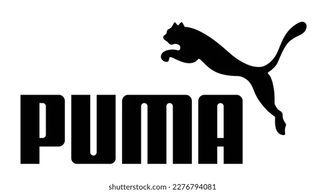
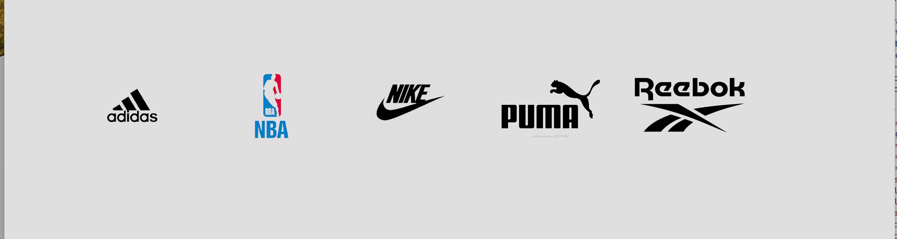

# css-cheatsheet

A complete CSS cheat sheet for developers.

### Selector:

```css
/* Element Selector */
p {
  /* Styles */
}

/* Class Selector */
.myClass {
  /* Styles */
}

/* ID Selector */
#myId {
  /* Styles */
}

/* Attribute Selector */
input[type='text'] {
  /* Styles */
}

/* Descendant Selector */
div p {
  /* Styles */
}

/* Pseudo-class Selector */
a:hover {
  /* Styles */
}
```

### Typography:

```css
/* Font Family */
.element {
  font-family: Arial, sans-serif;
}

/* Font Size */
.element {
  font-size: 16px;
}

/* Font Weight */
.element {
  font-weight: bold;
}

/* Text Color */
.element {
  color: #333;
}

/* Text Alignment */
.element {
  text-align: center;
}
```

### Display and Positioning:

```css
/* Display */
.element {
  display: block;
}

/* Position */
.element {
  position: relative;
}

/* Flexbox */
.container {
  display: flex;
  justify-content: center;
  align-items: center;
}

/* Grid */
.container {
  display: grid;
  grid-template-columns: 1fr 1fr;
}
```

### Background and Borders:

```css
/* Background Color */
.element {
  background-color: #f0f0f0;
}

/* Background Image */
.element {
  background-image: url('path/to/image.jpg');
}

/* Border Radius */
.element {
  border-radius: 5px;
}

/* Box Shadow */
.element {
  box-shadow: 2px 2px 5px rgba(0, 0, 0, 0.2);
}
```

### Animations and Transitions:

```css
/* Transition */
.element {
  transition: all 0.3s ease-in-out;
}

/* Keyframes Animation */
@keyframes slide {
  from {
    transform: translateX(0);
  }
  to {
    transform: translateX(100px);
  }
}

.element {
  animation: slide 2s infinite alternate;
}
```

### CSS Rest and Basic Rules

```css
/* This rule resets the margin and padding of all elements on the page to 0. It also sets the `box-sizing` property to `border-box`, which means that the width and height of an element will include its border.  */
/* Resetting Margins and Padding */
* {
  margin: 0;
  padding: 0;
  box-sizing: border-box;
}

/* This rule sets the default text color for the page to a dark gray color. It also sets the `--primary-text-color` variable to a blue color. This variable can be used to change the color of text throughout the page. */
:root {
  --text-color: #37415a;
  --primary-text-color: #0b49e7;
}

/* Setting the Default Font Family and Font Size */
html,
body {
  font-family: system-ui, -apple-system, BlinkMacSystemFont, 'Segoe UI', Roboto,
    Oxygen, Ubuntu, Cantarell, 'Open Sans', 'Helvetica Neue', sans-serif;
  font-size: 1.2rem;
  line-height: 1.6;
  color: var(--primary-text-color);
}
```

### css tips for working inconstinstenently sized logos

If you have a logo that is not a consistent size across different devices or screen sizes, it can be tricky to make sure it scales properly without <br>

```html
<section>
  <div class="container">
    <div class="photos">
      
      
      
      
      
    </div>
  </div>
</section>
```

```css
/* Create a container  margin-inline: auto; define same margin both left and right */
.container {
  max-width: 90%;
  margin-inline: auto;
}

/* Reset default rule of image */
img {
  max-width: 100%;
  max-height: 100%;
  display: block;
}

.image-container {
  background-color: var(--bg-primary);
  height: 100dvh;
  display: flex;
  justify-content: center;
  align-items: center;
}

.photos {
  padding: 2rem;
  display: flex;
  align-items: center;
  gap: 2rem;
}

.photos img {
  width: 15%;
  /* Make the images same size */
  aspect-ratio: 3/2;
  object-fit: contain;
  /* Reset the white background */
  mix-blend-mode: color-burn;
}
```

##### Output :


